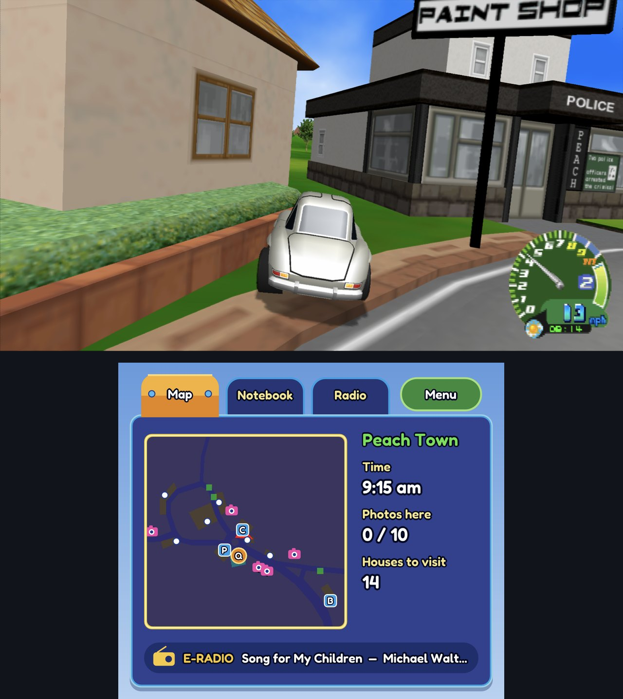
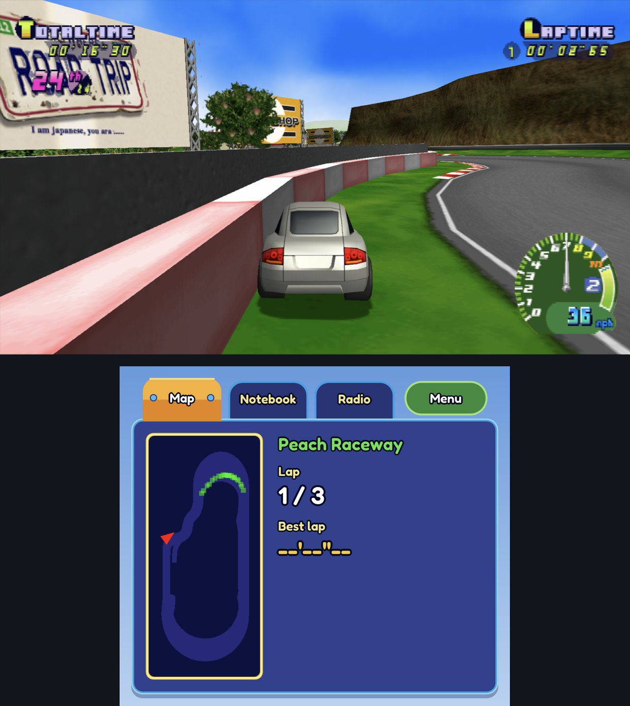
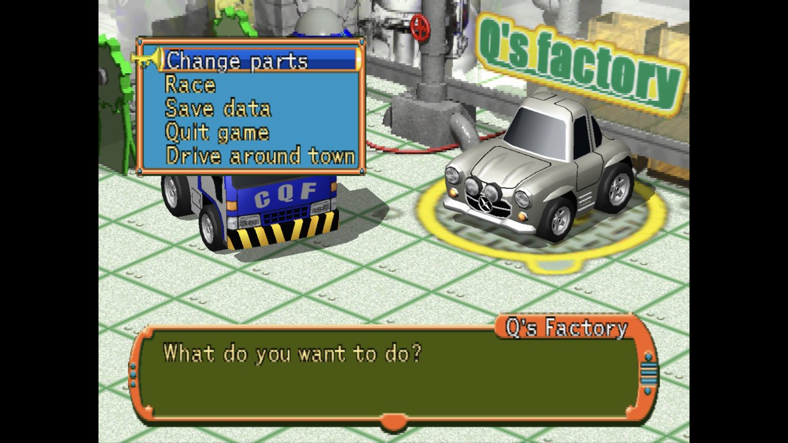
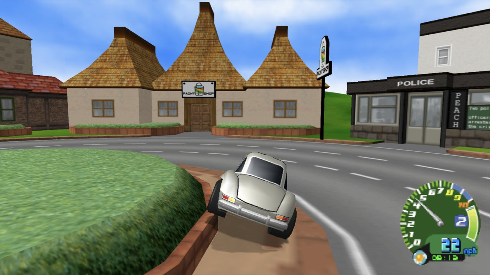
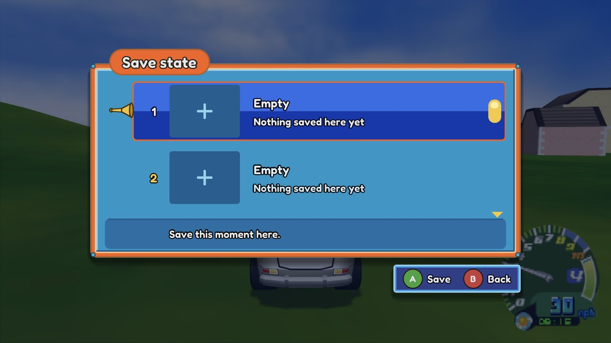

# Road Trip Recomp

**Road Trip** (*Choro Q HG 2*, PS2, 2002), running natively on **Windows**, **macOS** and **Android**, with
widescreen, high resolution, 120 Hz, HD texture packs, save states and a second-screen map.

This isn't an emulator. The game's program is *statically recompiled* into native code, built on
[PS2Recomp](https://github.com/ran-j/PS2Recomp). And it doesn't ship the game: the app builds it on
your device, from **your own disc**, the first time you open it.



> **No game code or data is included, not even in the built app.** On first launch the app reads
> your disc image, recompiles the game's program and compiles it with your device's own compiler.
> You need your own copy of *Road Trip* (USA, SLUS-20398).

## Features

- **Native speed.** The game, its vector unit (VU1) microcode and the sound driver run as native
  code; graphics are drawn on your GPU through Vulkan (Metal on the Mac).
- **Sharper picture.** Up to 4x render resolution, a progressive picture without the PS2's
  interlacing, and upscalers: AMD FSR 1 and FSR 3, NVIDIA DLSS and Intel XeSS (Windows), Snapdragon GSR 1/2, Arm ASR, MetalFX (Mac), plus FXAA,
  SMAA and TAA.
- **Widescreen.** 16:9, 16:10, 21:9 and 32:9, with the HUD kept at its shape, centred or at the
  screen edges.
- **120 and 240 Hz.** Extra frames are re-rendered from the game's own geometry, not interpolated,
  so they add no latency.
- **HD texture packs.** Dump the game's textures, upscale them, and load them as a pack.
- **Save states.** Four slots with pictures, from the in-game menu.
- **Second screen.** On dual-screen devices such as the AYN Thor, the lower screen shows the map,
  your notebook (stamps, coins, money), the radio, and lap times in races.
- **Modern controls.** Gas and brake on the triggers (analogue), reversing by holding brake, or the
  game's own layout, or your own. Rumble follows the road surface, the engine and collisions, and
  plays on the phone's motor when the pad has none.
- **Your settings are kept.** The game never saved its options; ours are saved, and the in-game
  menu (Guide button, Esc or F3) changes them while you play.

| | |
|---|---|
|  |  |
|  |  |

## What you need

**Your own copy of Road Trip (USA, SLUS-20398)**, as a disc image: `.cue`/`.bin`, `.iso` or `.chd`.
The app checks it against the known good dump (Redump) and tells you if yours looks different.

**macOS**
- A Mac with Apple Silicon, macOS 13 or later.
- Apple's Command Line Tools (a free download from Apple). If they're missing, the app offers to
  install them; you can also run `xcode-select --install` in Terminal.

**Windows**
- Windows 10 (1903) or 11 on a 64-bit x86 PC (SSE4.1 or newer), with a Vulkan 1.3 GPU and driver
  (NVIDIA, AMD or Intel; any current driver).
- About 2 GB free for the game files and the build. Nothing else to install: the compiler the app
  builds the game with ships inside it.

**Android**
- Android 12 or later on a 64-bit ARM device with a Vulkan GPU. Developed on the AYN Thor
  (Snapdragon 8 Gen 2); other Snapdragon 8-series handhelds and phones should work.
- About 2 GB free for the game files and the build.

## Install

Download the latest **zip** (Windows), **DMG** (Mac) or **APK** (Android) from
[Releases](https://github.com/silentsudin/RoadTripAdventure-recomp/releases).

**Windows:** unzip `RoadTripRecomp-<version>-Windows-x64.zip` anywhere you can write to (not
*Program Files*; the folder must stay together) and run `RoadTrip.exe`. SmartScreen may warn about
an unsigned app: *More info → Run anyway*. Settings, saves and the game built on your PC live in
`%LOCALAPPDATA%\RoadTripRecomp`. AMD FSR 3 is included and works on any GPU.

*Optional, for NVIDIA DLSS and Intel XeSS:* download `RoadTripRecomp-<version>-Windows-x64-DLSS-XeSS-addon.zip`
from the same release and unzip its files **into the same folder as `RoadTrip.exe`** (next to
`rt_fsr3.dll`; say yes to merging the `licenses` folder). They are a separate download because
NVIDIA's and Intel's licences don't allow bundling their libraries into this GPL app. Then pick the
upscaler in **Options → Graphics → Upscaling**; an upscaler only shows in the list when it works on
your GPU:

| Upscaler | Needs |
|---|---|
| AMD FSR 3 | any GPU (included) |
| NVIDIA DLSS | an NVIDIA RTX GPU with a current driver, and the add-on |
| Intel XeSS | a recent GPU (Intel Arc runs it best; NVIDIA and AMD work too), and the add-on |

An upscaler only has work to do when the window is bigger than the game's render resolution. At the
default **Supersampling** (8x) the game renders 1280x896, so you'll see the difference in a larger
window or fullscreen on a 1440p or 4K display; a lower Supersampling renders smaller and gives the
upscaler more to do (faster, softer).
If DLSS or XeSS is missing from the list, check that the add-on's files sit beside `RoadTrip.exe`,
that your GPU is supported, and that your graphics driver is up to date.

**macOS:** open the DMG and drag *Road Trip* to Applications. If macOS says the app can't be
checked for malicious software, open **System Settings → Privacy & Security** and choose
**Open Anyway** (or run `xattr -dr com.apple.quarantine "/Applications/Road Trip.app"`).

**Android:** open the APK on the device and allow installing from that source. Updating from a
build signed with another key needs the old app uninstalled first (your saves live in the app's
storage, so back them up via a save in the game's memory card first if you care about them).

## First launch

1. Pick your disc image when asked.
2. The app copies the game files off it (about 512 MB) and builds the game for your device:
   **under a minute on an M-series Mac, about 2.5 minutes on the AYN Thor**. A progress bar shows
   the time left. This happens once; later launches start straight away.
3. Play. Start Adventure from the title screen, or try a Quick Race.

## Controls

The keyboard and every connected controller work together. Player 1 is the keyboard and the
first controller; a second controller is player 2.

| | Keyboard | Controller |
|---|---|---|
| Steer / menus | Arrow keys | D-pad or left stick |
| Gas (Modern) | | RT |
| Brake / reverse (Modern) | | LT (hold at a standstill to reverse) |
| Cross (confirm, Classic gas) | X, Space | A |
| Circle | C | B |
| Square (Classic brake) | Z | X |
| Triangle (back) | V | Y |
| L1 / R1 | Q / E | LB / RB |
| L2 / R2 | 1 / 3 | LT / RT |
| Start / Select | Enter / Tab | Menu / View |
| **Our menu** (settings, save states) | Esc or F3 | Guide, or Back + Start held |

Change the driving layout (Modern, Classic or Custom), rebind controls, set dead zones, rumble
strength and which controller belongs to which player under **Menu → Controllers**.

## Settings worth knowing

Everything is in the in-game menu (**Options**). A few highlights:

- **Display:** **Display mode** (Window, Borderless fullscreen or Fullscreen on Mac and Windows;
  Alt+Enter or F11 switches), aspect ratio and HUD position; **Frame rate** 60/120/240; **Frame skip** (Auto keeps
  the game at full speed on slower devices by pausing generated frames first).
- **Graphics:** render resolution (supersampling), the upscaler, anti-aliasing and sharpness;
  **Interlacing** off (default) gives a clean progressive picture.
- **Texture pack:** choose a pack from your packs folder (see below).
- **Second screen** (dual-screen devices) and the **performance overlay**.

## HD texture packs

1. Turn on texture dumping (`dump = true` under `[textures]` in `settings.toml`), play, and the game
   saves every texture it uses as PNG, named by a hash of its pixels.
2. Edit or upscale them (any size), keeping the file names.
3. Put them in a folder under `textures/packs/` and pick it under **Options → Texture pack**.

On Android a pack is converted once to a compressed format (ASTC) the first time it's used, so it
loads smoothly while you play.

Where the folders are:
- **macOS:** `~/Library/Application Support/RoadTripRecomp/textures/`
- **Android:** `Android/data/io.github.silentsudin.roadtrip/files/textures/`, reachable from a
  computer over USB.

## Your data

- **macOS:** `~/Library/Application Support/RoadTripRecomp/`, holding `disc/` (the game files from
  your disc), `game/` (the game built from them), `saves/` (memory cards), `states/` (save states)
  and `settings.toml`.
- **Windows:** `%LOCALAPPDATA%\RoadTripRecomp`, with the same contents as on macOS (open it with
  `%LOCALAPPDATA%` in the Explorer address bar). Texture packs go in `textures\packs`.
- **Android:** the app's own storage; texture packs and dumps as above.

**Don't share anything from these folders except your own texture packs:** they hold the game's
files.

## Status and known issues

Adventure (towns, fields, shops, races) and Quick Race are playable on all three platforms. Known
issues are tracked in
[Issues](https://github.com/silentsudin/RoadTripAdventure-recomp/issues). Bug reports are welcome:
please say which device, and attach the log if you can (Android: `adb logcat -s RoadTrip`).

## Building it yourself

See [docs/DEVELOPING.md](docs/DEVELOPING.md) for building the Mac and Android apps, the regression
suite and how the recomp works. In short, on an Apple Silicon Mac (on Windows,
`python scripts/pipeline.py bootstrap build run` after `winget install Kitware.CMake Ninja-build.Ninja`;
it fetches the pinned llvm-mingw toolchain itself):

```sh
brew install cmake ninja python molten-vk
git clone https://github.com/silentsudin/RoadTripAdventure-recomp.git && cd RoadTripAdventure-recomp
python3 scripts/pipeline.py all run
```

No disc image is needed to build the app.

## Related work

- [ran-j/PS2Recomp](https://github.com/ran-j/PS2Recomp): the PS2 static recompiler this is built on
  (our fork: [silentsudin/PS2Recomp](https://github.com/silentsudin/PS2Recomp), branch `roadtrip`).
- [Arntzen-Software/parallel-gs](https://github.com/Arntzen-Software/parallel-gs): the GPU GS.
- [mholeys/choroq-hg2-decomp](https://github.com/mholeys/choroq-hg2-decomp): a decomp of the PAL
  release (SLES-51356).
- [mholeys/roadtrip-choroq-tools](https://github.com/mholeys/roadtrip-choroq-tools): documentation
  and tools for the game's asset formats.
- [loveemu/tsq2psf](https://github.com/loveemu/tsq2psf): the TSQ/TVB music format.

## Licence

This project is licensed under the **GNU General Public License v3.0** ([LICENSE](LICENSE)), as is
PS2Recomp, which it's built on. The apps also include third-party components under their own
licences (LGPL, MIT, BSD, zlib, Apache-2.0, SIL OFL); their notices ship with the apps (in the
Mac app's `Contents/Resources/licenses`, the Windows build's `Resources\licenses` (the DLSS/XeSS
add-on carries NVIDIA's and Intel's own in its `licenses` folder) and the APK's `assets/licenses`) and are listed in
[`scripts/collect_licenses.py`](scripts/collect_licenses.py).

*Road Trip* and *Choro Q* are trademarks of their owners (Takara / E-game; published in North
America by Conspiracy Entertainment). This project isn't affiliated with or endorsed by them, and
contains none of their code or data.
